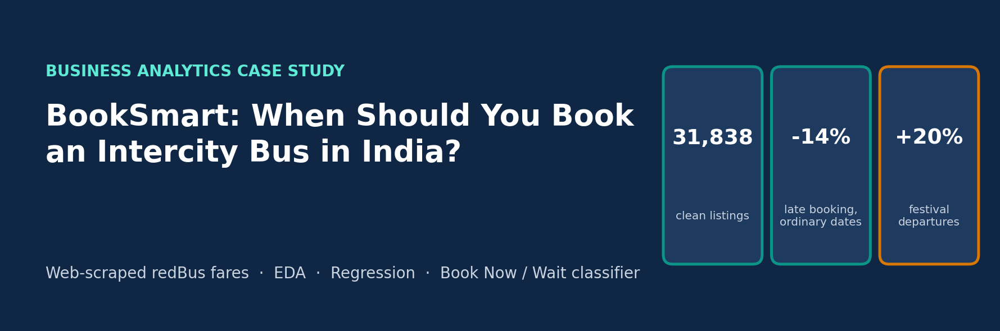
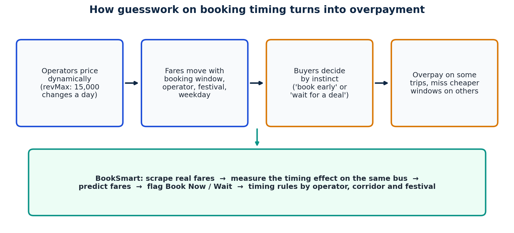
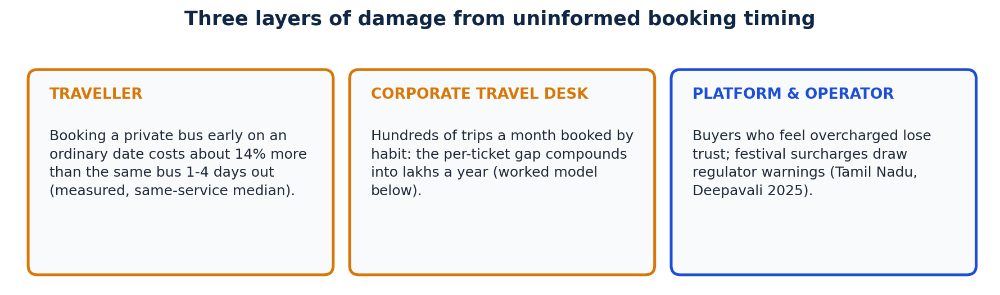
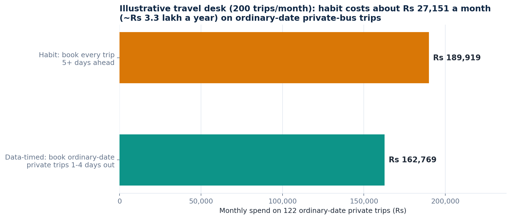
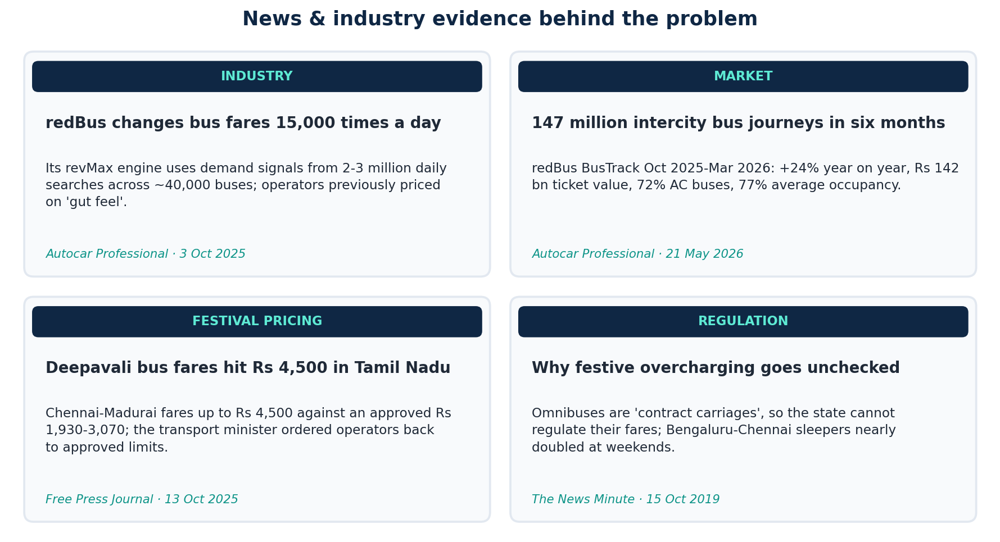
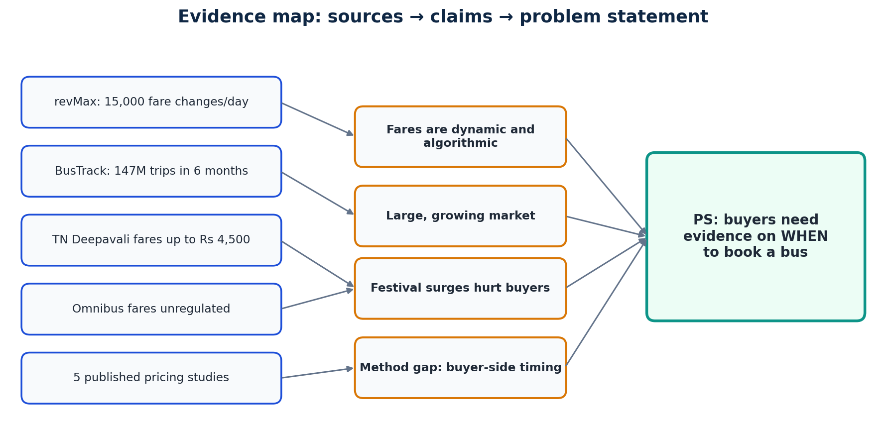
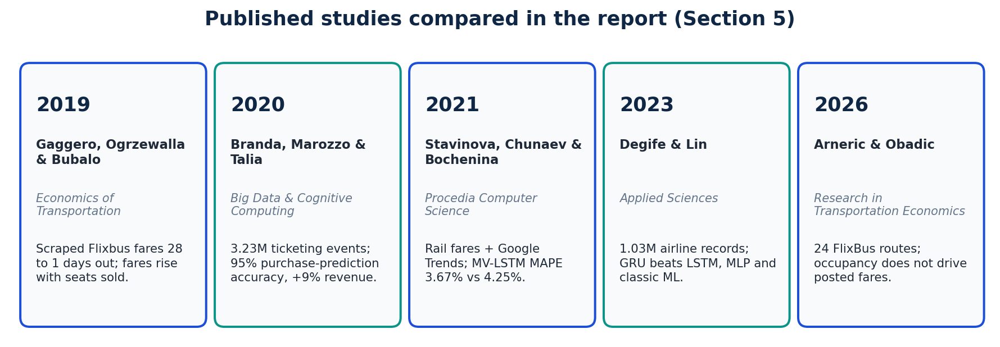
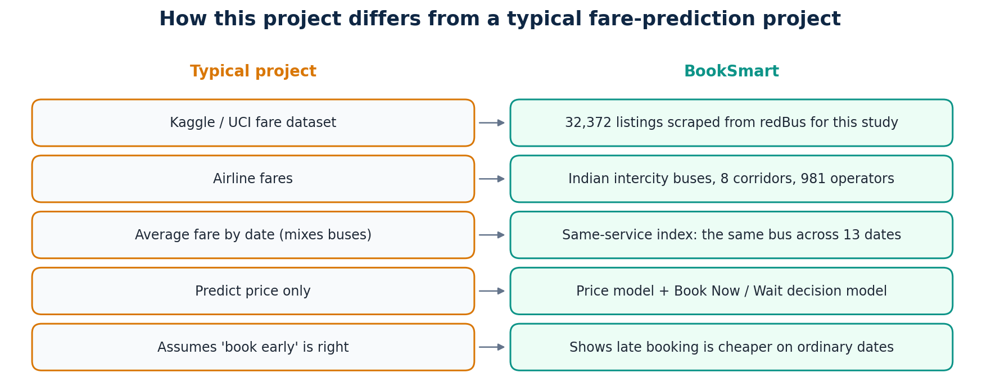
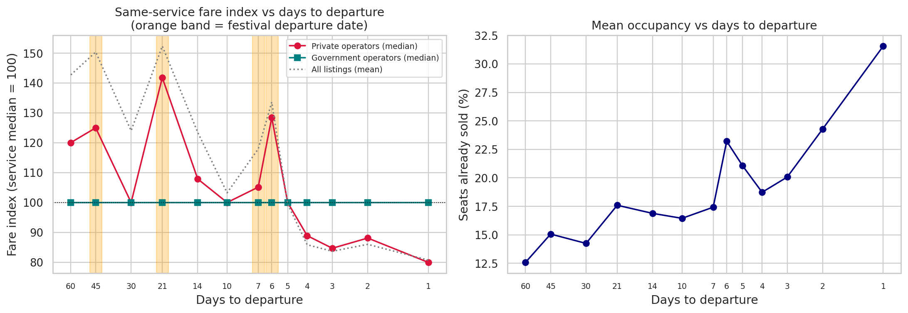
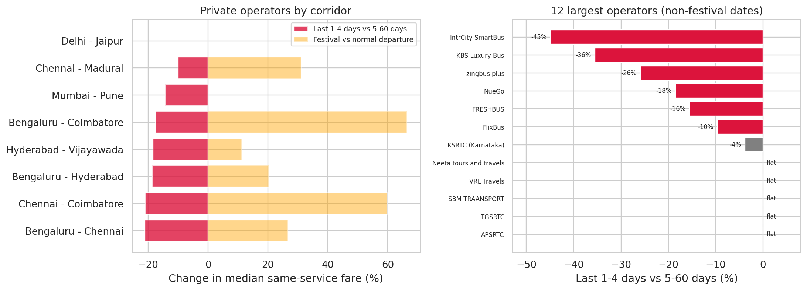

# BookSmart: Predicting Optimal Booking Timing for Intercity Bus Travel Using Web-Scraped Fare Data

<p align="center">
  
</p>

<p align="center">
  <b>Domain:</b> Transportation · Intercity bus travel & online ticketing (India) &nbsp;|&nbsp;
  <b>Method:</b> Web scraping · EDA · Regression · Classification · Recommendations<br/>
  <b>Data:</b> 32,372 listings scraped from redBus (own data, no Kaggle / UCI dumps)
</p>

<p align="center">
  <b>Deepak S</b> · CB.SC.U4CSE23267 · CSE-C · Business Analytics individual case study
</p>

---

## Table of contents

1. [Problem statement](#1-problem-statement)
2. [Why this hurts: cost & damage estimate](#2-why-this-hurts-cost--damage-estimate)
3. [Why it matters now](#3-why-it-matters-now)
4. [News & industry articles](#4-news--industry-articles)
5. [Research papers](#5-research-papers-state-of-the-art-comparison)
6. [How this is different](#6-how-this-is-different)
7. [Data, methods & results](#7-data-methods--results)
8. [Repository layout](#8-repository-layout)
9. [Status](#9-status)

---

## 1. Problem statement

Intercity bus operators in India price seats **dynamically**. redBus runs an algorithmic pricing engine that changes fares about **15,000 times a day** across roughly 40,000 buses ([Autocar Professional, 2025](https://www.autocarpro.in/news/the-algorithm-that-adjusts-bus-prices-15000-times-a-day-129061)). The fare for the same route, operator, bus type and departure time therefore depends on **when** the ticket is bought.

Buyers do not have that information. Travellers, corporate travel desks and bulk bookers choose when to book by habit: weeks ahead because "fares only go up", or at the last minute to "wait for a deal".

### The problem (one sentence)

> **Without evidence on how bus fares move with the booking window, buyers overpay on some trips and miss cheaper windows on others, and the loss grows during festivals, when private fares are unregulated.**

### Analytics objective

Using **self-scraped redBus listings** (8 corridors × 13 departure dates, 1-60 days ahead), measure what drives fares, **predict the expected fare** of a listing, and **classify a quoted fare as Book Now or Wait**. Then turn the results into timing rules for travellers, travel desks, platforms and operators.

<p align="center">
  
</p>

---

## 2. Why this hurts: cost & damage estimate

Unlike a pure proposal, this repo **measures** the mechanism from the scraped data. Only the size of the travel desk in §2.3 is an illustrative input.

### 2.1 Three layers of damage

<p align="center">
  
</p>

| Layer | What is damaged | Evidence | Source |
|-------|-----------------|----------|--------|
| **Traveller** | Pays more than needed for the same seat | Same private bus is **14.3% cheaper** 1-4 days out than 5-60 days out on ordinary dates (median same-service index 85.7 vs 100) | This study, `analysis.ipynb` §5.1 |
| **Corporate travel desk** | Travel budget leaks across hundreds of trips | Per-ticket gap × volume; worked model below | This study + illustrative volume |
| **Platform & operator** | Buyer trust; regulatory pressure | Deepavali 2025: Chennai-Madurai omnibus fares up to **₹4,500** vs approved ₹1,930-3,070; minister ordered fares back to approved limits | [Free Press Journal, 13 Oct 2025](https://www.freepressjournal.in/business/tamil-nadus-omnibus-operators-raise-fares-despite-state-transport-departments-warnings) |

### 2.2 Measured evidence from the scraped data

| Claim | Evidence (31,838 listings, 25 Sep 2026 scrape) | Where |
|-------|-----------------------------------------------|-------|
| Late booking is cheaper on ordinary dates (private buses) | Median same-service fare index **85.7** at 1-4 days vs **100** at 5-60 days → **-14.3%** | notebook §5.1 |
| The effect is timing, not weekday | Same services, same weekday: Monday 3 vs 10 days **-9.1%** (2,287 services); Sunday 2 vs 30 days **-25.0%** | notebook §5.1, report Table 3 |
| Festivals reverse it | Private festival departures **+20%** above normal (median); up to **+60-66%** on Coimbatore corridors | notebook §8 |
| Government buses don't move | APSRTC, TGSRTC, RSRTC: median index 100 at every booking window where they were on sale | notebook §5.1, §8 |
| Most large private brands discount late | 36 of 56 operators cut fares >5% in the last 4 days; none raise them (IntrCity SmartBus -45%, KBS -36%, zingbus plus -26%) | notebook §8 |

### 2.3 Worked ₹ travel-desk model

> **How to read this model**
> - **Measured** inputs come from the scraped data (fare, discount, trip mix).
> - **Illustrative** input: a travel desk booking 200 intercity bus trips a month. Replace it with real volumes.
> - It covers **ordinary-date private-bus trips only**. The data can't show how festival fares change with the booking window (see limitations).

| Input | Value | Type |
|-------|------:|------|
| Trips / month (N) | 200 | Illustrative |
| Share of trips on private buses | 86.9% | Measured (sample mix) |
| Share of trips on ordinary (non-festival) dates | 70.0% | Measured (sample mix) |
| → Ordinary-date private trips | ≈ 122 | Derived |
| Mean private fare when booked 5-60 days out (ordinary dates) | ₹1,560 | Measured |
| Last-minute discount (same bus, 1-4 days out) | 14.3% | Measured |

| Metric | Habit: book 5+ days ahead | Data-timed: book 1-4 days out | Gap (damage) |
|--------|-------------------------:|-------------------------------:|-------------:|
| Monthly spend on ordinary-date private trips | ₹1,89,919 | ₹1,62,769 | **₹27,151 / month** |
| Annualised | | | **≈ ₹3.3 lakh / year** |
| 10 such desks | | | **≈ ₹33 lakh / year** |

<p align="center">
  
</p>

### 2.4 Formula

```
Ordinary-date private trips   n = N × P(private) × P(ordinary date)
Habit spend                   S_early = n × mean early fare
Data-timed spend              S_timed = S_early × (1 − last-minute discount)
Monthly damage                = S_early − S_timed
```

All numbers are computed from `data/cleaned/bus_fares_clean.csv` by `assets/generate_figures.py`.

---

## 3. Why it matters now

1. **A large, fast-growing market.** redBus BusTrack recorded **147.19 million** intercity bus journeys from October 2025 to March 2026, **+24%** year on year, with **₹142.16 billion** in ticket value; 72% of journeys were on AC buses ([Autocar Professional, 21 May 2026](https://www.autocarpro.in/news/intercity-bus-passenger-volumes-rise-24-percent-in-second-half-of-fy2026-redbus-report-132718)).
2. **Pricing is now algorithmic.** redBus's revMax engine uses airline revenue-management methods (Littlewood's rule, EMSR) and makes ~15,000 fare changes a day ([redBus tech blog, 2022](https://medium.com/redbus-in/dynamic-pricing-platform-3-5-8aaf9d78816d); [Autocar Professional, 2025](https://www.autocarpro.in/news/the-algorithm-that-adjusts-bus-prices-15000-times-a-day-129061)). Buyers still use rules of thumb.
3. **Festival surges are a live issue.** Private omnibuses are "contract carriages", so states cannot regulate their fares ([The News Minute, 2019](https://www.thenewsminute.com/tamil-nadu/how-tn-omnibus-operators-overcharge-during-festive-season-and-get-away-it-110559)), and Deepavali 2025 fares drew official warnings in Tamil Nadu ([Free Press Journal, 2025](https://www.freepressjournal.in/business/tamil-nadus-omnibus-operators-raise-fares-despite-state-transport-departments-warnings)).

---

## 4. News & industry articles

Only sources that support **(A)** dynamic pricing, **(B)** market scale, **(C)** festival surges or **(D)** the regulatory gap.

<p align="center">
  
</p>

| # | Article | What it establishes | Link to **our PS** |
|---|---------|---------------------|--------------------|
| 1 | **Autocar Professional (3 Oct 2025)**: *The algorithm that adjusts bus prices 15,000 times a day* | revMax ML pricing; ~40,000 buses daily, 5,500 private operators, 2-3M daily searches | Fares are set by algorithms, so booking timing is a **data problem**, not a guess |
| 2 | **redBus tech blog (May 2022)**: *Dynamic Pricing Platform* | Airline RM heuristics (Littlewood, EMSR) adapted to buses | Confirms **demand-driven price changes** we measure |
| 3 | **Autocar Professional (21 May 2026)**: *Intercity bus passenger volumes rise 24%* (redBus BusTrack) | 147.19M journeys in 6 months, ₹142.16 bn value, 77% occupancy | **Scale**: small per-ticket gains add up |
| 4 | **Free Press Journal (13 Oct 2025)**: *TN omnibus operators raise fares for festive season* | Deepavali fares up to ₹4,500 (Chennai-Madurai), ₹3,000 (Chennai-Coimbatore); ministerial warning | Supports our **festival premium** finding and the Chennai corridors we scraped |
| 5 | **The News Minute (15 Oct 2019)**: *How TN omnibus operators overcharge during festive season* | Contract-carriage status means fares are unregulated; weekend fares much higher | Explains **why** buyers need their own evidence |

### Evidence map

<p align="center">
  
</p>

### Citations (as used in the report)

- Autocar Professional. *The algorithm that adjusts bus prices 15,000 times a day.* 3 Oct 2025. https://www.autocarpro.in/news/the-algorithm-that-adjusts-bus-prices-15000-times-a-day-129061
- Yadav, M. K. *Dynamic Pricing Platform (3/5).* redBus India Blog, May 2022. https://medium.com/redbus-in/dynamic-pricing-platform-3-5-8aaf9d78816d
- Autocar Professional. *Intercity bus passenger volumes rise 24% in second half of FY2026: redBus report.* 21 May 2026. https://www.autocarpro.in/news/intercity-bus-passenger-volumes-rise-24-percent-in-second-half-of-fy2026-redbus-report-132718
- Free Press Journal. *Tamil Nadu's omnibus operators raise fares for festive season despite state transport department's warnings.* 13 Oct 2025. https://www.freepressjournal.in/business/tamil-nadus-omnibus-operators-raise-fares-despite-state-transport-departments-warnings
- Kaveri, M. *How TN omnibus operators overcharge during festive season and get away with it.* The News Minute, 15 Oct 2019. https://www.thenewsminute.com/tamil-nadu/how-tn-omnibus-operators-overcharge-during-festive-season-and-get-away-it-110559

---

## 5. Research papers (state-of-the-art comparison)

<p align="center">
  
</p>

| Published study / Year | Dataset | Method | Metric | Key result | Comparison with this work |
|---|---|---|---|---|---|
| [Gaggero, Ogrzewalla & Bubalo (2019)](https://doi.org/10.1016/j.ecotra.2019.100120), *Economics of Transportation* | Flixbus fares scraped daily, 5 city pairs, 28→1 days out | Panel fixed effects | Coefficients | Fare rises with seats sold; lowest fare rises toward departure | Closest design. Their single-operator market escalates; our multi-operator Indian market discounts late on ordinary dates |
| [Branda, Marozzo & Talia (2020)](https://doi.org/10.3390/bdcc4040036), *BDCC* | 3.23M bus-ticketing event logs | NB, LR, DT, RF, XGBoost + pricing strategy | Accuracy, revenue | 95% purchase prediction; +6% tickets, +9% revenue | Seller-side, private logs; ours is buyer-side, public data. Targets differ, so scores aren't comparable |
| [Stavinova, Chunaev & Bochenina (2021)](https://doi.org/10.1016/j.procs.2021.10.034), *Procedia CS* | Renfe rail fares, Madrid-Barcelona | ARIMA, LSTM, ARIMAX, MV-LSTM + Google Trends | RMSE, MAPE | MV-LSTM MAPE 3.67% vs 4.25% | One aggregate series vs our 31,838 listings; search trends are a good add-on for festival demand |
| [Degife & Lin (2023)](https://doi.org/10.3390/app13106032), *Applied Sciences* | 1.03M Ethiopian Airlines records | GRU vs LSTM, MLP, classic ML | MAE, RMSE, R² | GRU best on all metrics | Internal carrier data + deep learning; ours is public data + interpretable trees (R² 0.83) |
| [Arnerić & Obadić (2026)](https://doi.org/10.1016/j.retrec.2026.101794), *Research in Transportation Economics* | FlixBus, 24 Croatian routes, 2022 | Panel FE/RE/two-way | Diagnostics | Occupancy not significant for fares | Consistent with our finding that online occupancy doesn't push fares up |

> Scores from different datasets and settings are **not** directly comparable; the report (Section 5) compares method, data, evaluation, strengths and limitations.

---

## 6. How this is different

<p align="center">
  
</p>

| Common project | This project |
|----------------|--------------|
| Kaggle airline-fare dataset | **32,372 listings scraped from redBus** for this study |
| Average fare by date (mixes different buses) | **Same-service fare index**: the same bus tracked across 13 departure dates |
| Predict price only | Price model **+ Book Now / Wait decision model** |
| Assumes "book early" is always right | Finds **late booking is cheaper on ordinary dates**, with festivals as the exception |
| Weak link to money | Measured per-ticket gap + ₹ travel-desk model |

---

## 7. Data, methods & results

### 7.1 Data collection

| | |
|---|---|
| Source | [redBus](https://www.redbus.in) public search-results pages (no login) |
| Procedure | Browser-run collector calling the search page's own JSON endpoint; 100 results per page; government-operator groups expanded; 1.2-1.5 s delay. Full details: [`docs/DATA_COLLECTION.md`](docs/DATA_COLLECTION.md), script: [`scraper/redbus_collector.js`](scraper/redbus_collector.js) |
| Coverage | 8 corridors × 13 departure dates (1-60 days ahead), scraped 25 Sep 2026 |
| Records | 32,372 raw → **31,838 clean**, 981 operators, 3,838 distinct bus services |
| Privacy | Public listing data only; no personal data; service codes anonymised |

### 7.2 Analytics plan & status

| Step | What | Status |
|------|------|--------|
| 1 | Problem statement + cost importance | Done |
| 2 | Web scraping (redBus, 104 searches) | Done |
| 3 | Cleaning, feature engineering (occupancy, festival flag, bus class, govt flag) | Done |
| 4 | EDA incl. same-service fare index and same-weekday checks | Done |
| 5 | Regression: Linear, Random Forest, Gradient Boosting (log fare) | Done |
| 6 | Classification: Book Now / Wait, Logistic Regression & Random Forest | Done |
| 7 | Insights, recommendations, SOTA comparison, report | Done |

### 7.3 Key results

<p align="center">
  
</p>

| Model | Metric | Result |
|-------|--------|--------|
| Fare regression, Random Forest | Test R² (log fare) / MAE / MAPE | **0.830** / ₹282 / 18.8% (Linear: 0.575) |
| Fare regression, Gradient Boosting | Test R² (log fare) | 0.789 |
| Book Now / Wait, Random Forest | ROC-AUC / F1 (Book Now) / recall | **0.893** / 0.546 / 71% |
| Book Now / Wait, majority baseline | Accuracy | 0.884 (never finds a bargain) |

<p align="center">
  
</p>

**Recommendations**
- **Travellers / travel desks:** on ordinary dates, book private buses **1-4 days out** (~14% cheaper). Book **festival and Friday departures early** as a precaution. Book **government buses** whenever convenient.
- **Platforms:** show a Book Now / Wait badge that says "likely cheaper closer to the date" as often as "good price now".
- **Operators:** deep last-minute cuts show early fares on ordinary dates are set above demand. Early-bird tiers would fill seats sooner.

**Limitations:** one scrape day (compares departure dates, not one ticket over time); near and far dates differ in season; occupancy counts the redBus seat map only (redBus reports 77% final occupancy overall); festival windows defined by calendar.

---

## 8. Repository layout

```
.
├── README.md                       ← this file
├── analysis.ipynb                  ← preprocessing, EDA, models, evaluation, outputs
├── Case_Study_Report.pdf           ← final report (6 pages)
├── Case_Study_Report.docx          ← editable source of the report
├── data/
│   ├── raw/bus_fares_raw_2026-09-25.csv    ← 32,372 listings as scraped
│   └── cleaned/bus_fares_clean.csv         ← 31,838 cleaned, anonymised records
├── scraper/redbus_collector.js     ← browser collector used for data/raw
├── docs/
│   ├── PROBLEM_STATEMENT.md
│   └── DATA_COLLECTION.md
└── assets/
    ├── generate_figures.py         ← regenerates README images from data/cleaned
    ├── images/                     ← banner, flow, cost model, news/paper cards
    └── figures/                    ← charts written by analysis.ipynb
```

Reproduce:

```bash
pip install pandas numpy matplotlib seaborn scikit-learn jupyter
jupyter nbconvert --to notebook --execute analysis.ipynb   # writes data/cleaned + assets/figures
python assets/generate_figures.py                          # README images
```

---

## 9. Status

| Item | Status |
|------|--------|
| Problem statement & cost importance | Done |
| Web-scraped dataset (32,372 listings) | Done |
| Preprocessing & EDA | Done |
| Regression + classification models | Done |
| State-of-the-art comparison (5 studies) | Done |
| Report (PDF) | Done |
| Push to GitHub Classroom repo | Pending (link awaited) |

---

## Academic note

Prepared for an individual Business Analytics case study. Data was collected from publicly accessible redBus pages for academic use only; no personal data was collected. The ₹ travel-desk model uses one illustrative input (200 trips/month); all other numbers are computed from the scraped data.

## References

1. redBus, bus ticket search results, https://www.redbus.in (data collected 25 Sep 2026).
2. Gaggero, A. A., Ogrzewalla, L., & Bubalo, B. (2019). Pricing of the long-distance bus service in Europe: The case of Flixbus. *Economics of Transportation*, 19, 100120. https://doi.org/10.1016/j.ecotra.2019.100120
3. Branda, F., Marozzo, F., & Talia, D. (2020). Ticket sales prediction and dynamic pricing strategies in public transport. *Big Data and Cognitive Computing*, 4(4), 36. https://doi.org/10.3390/bdcc4040036
4. Stavinova, E., Chunaev, P., & Bochenina, K. (2021). Forecasting railway ticket dynamic price with Google Trends open data. *Procedia Computer Science*, 193, 333-342. https://doi.org/10.1016/j.procs.2021.10.034
5. Degife, W. A., & Lin, B.-S. (2023). Deep-learning-powered GRU model for flight ticket fare forecasting. *Applied Sciences*, 13(10), 6032. https://doi.org/10.3390/app13106032
6. Arnerić, J., & Obadić, L. (2026). Key factors in dynamic pricing of FlixBus fares: A panel analysis of international and domestic routes in Croatia. *Research in Transportation Economics*, 118, 101794. https://doi.org/10.1016/j.retrec.2026.101794
7. HappyFares (2026). India festive travel calendar 2026. https://www.happyfares.in/blog/diwali-festive-season-flight-guide-2026/
8. Pedregosa, F., et al. (2011). Scikit-learn: Machine learning in Python. *JMLR*, 12, 2825-2830.
9. Breiman, L. (2001). Random forests. *Machine Learning*, 45(1), 5-32.
10. Autocar Professional (2026). Intercity bus passenger volumes rise 24% in second half of FY2026: redBus report. https://www.autocarpro.in/news/intercity-bus-passenger-volumes-rise-24-percent-in-second-half-of-fy2026-redbus-report-132718
